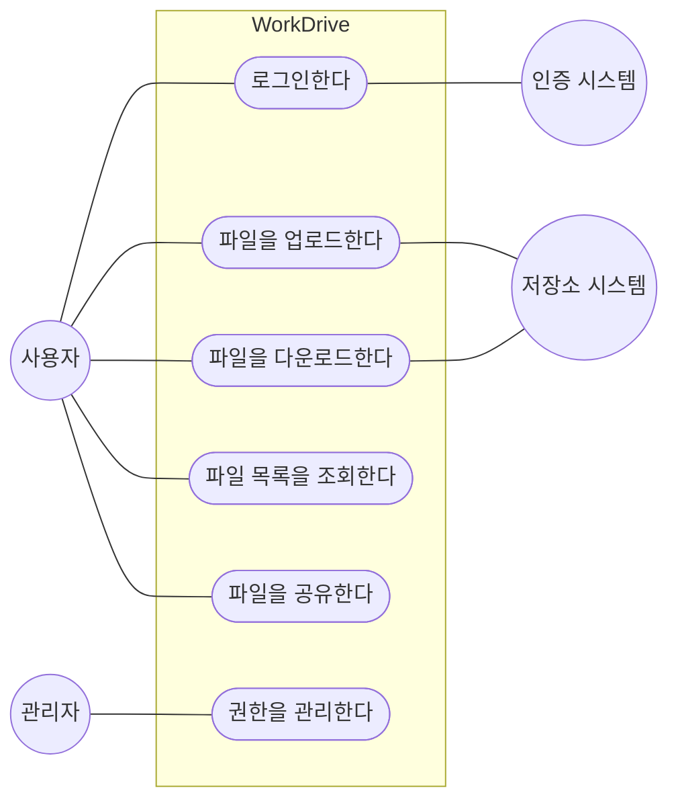
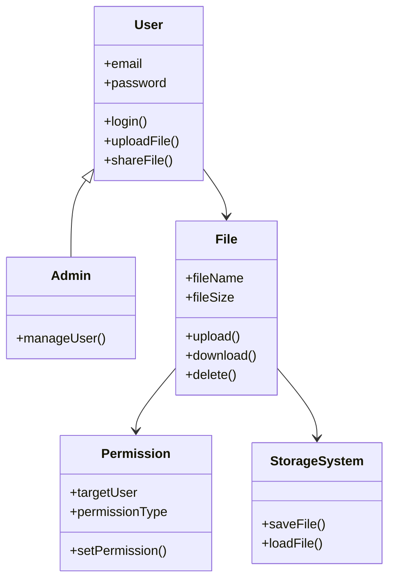
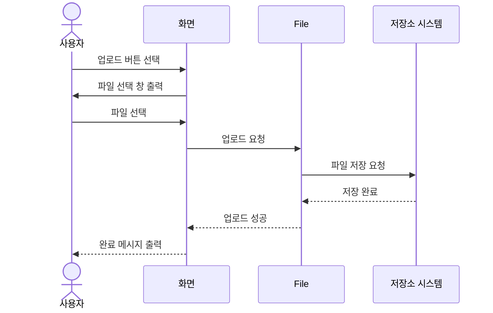
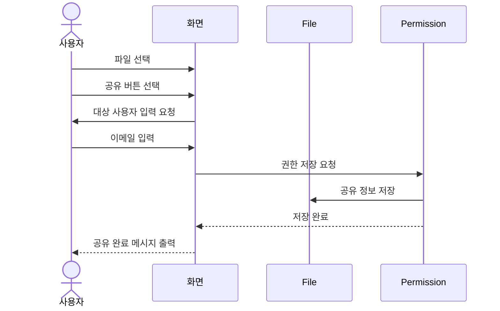
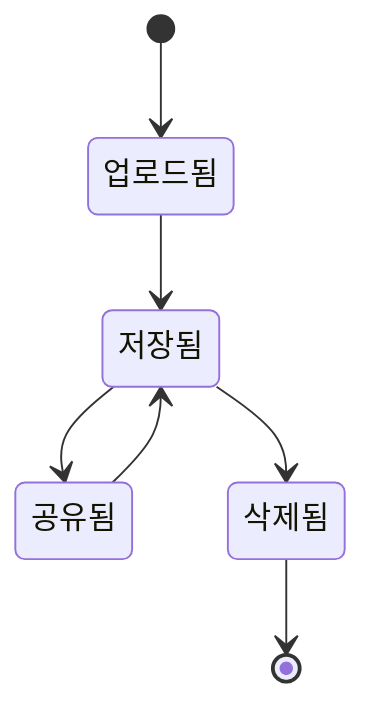

# WorkDrive 요구사항 분석서

## 1. 프로젝트 개요

### 1.1 문서 목적

본 문서는 WorkDrive 시스템의 요구사항을 객체지향 관점에서 분석하기 위한 문서이다.  
요구사항 정의서에서 정리한 기능을 기반으로 Use Case, Class Diagram, Sequence Diagram 등을 작성하여 시스템 구조와 동작을 분석한다.

### 1.2 시스템 소개

WorkDrive는 사용자가 파일을 업로드, 다운로드, 조회, 공유할 수 있는 웹 기반 클라우드 파일 관리 시스템이다.

사용자는 파일을 안전하게 저장하고 다른 사용자와 공유할 수 있으며, 권한 관리를 통해 접근 가능한 사용자를 제한할 수 있다.

---

# 2. 시스템 개요

## 2.1 Actor Table

| Actor | 설명 |
|---|---|
| 사용자 | 파일 업로드, 다운로드, 공유 기능을 사용하는 사람 |
| 관리자 | 사용자 계정 및 시스템을 관리하는 사람 |
| 저장소 시스템 | 실제 파일 데이터를 저장하는 시스템 |
| 인증 시스템 | 로그인 정보를 확인하는 시스템 |

---

## 2.2 Use Case Diagram

---

# 3. 요구사항 분석

## 3.1 Use Case Description

---

### Use Case Name : 로그인한다

| 항목 | 내용 |
|---|---|
| ID | U-01 |
| Primary Actor | 사용자 |
| Importance Level | High |
| Brief Description | 사용자가 이메일과 비밀번호를 입력하여 로그인한다. |

### Normal Flow

1. 사용자는 이메일과 비밀번호를 입력한다.
2. 사용자는 로그인 버튼을 누른다.
3. 시스템은 인증 시스템에 로그인 정보를 전달한다.
4. 인증이 성공하면 메인 화면을 출력한다.

### Exception Flow

- 이메일 또는 비밀번호가 틀리면 로그인 실패 메시지를 출력한다.

---

### Use Case Name : 파일을 업로드한다

| 항목 | 내용 |
|---|---|
| ID | U-02 |
| Primary Actor | 사용자 |
| Importance Level | High |
| Brief Description | 사용자가 파일을 업로드한다. |

### Normal Flow

1. 사용자는 업로드 버튼을 선택한다.
2. 시스템은 파일 선택 창을 출력한다.
3. 사용자는 업로드할 파일을 선택한다.
4. 시스템은 저장소 시스템에 파일 저장을 요청한다.
5. 시스템은 업로드 완료 메시지를 출력한다.

### Exception Flow

- 파일 업로드 실패 시 오류 메시지를 출력한다.

---

### Use Case Name : 파일을 공유한다

| 항목 | 내용 |
|---|---|
| ID | U-03 |
| Primary Actor | 사용자 |
| Importance Level | Medium |
| Brief Description | 사용자가 다른 사용자에게 파일 공유 권한을 설정한다. |

### Normal Flow

1. 사용자는 공유할 파일을 선택한다.
2. 사용자는 공유 버튼을 누른다.
3. 시스템은 공유 대상 입력 화면을 출력한다.
4. 사용자는 대상 이메일과 권한을 입력한다.
5. 시스템은 공유 정보를 저장한다.
6. 시스템은 공유 완료 메시지를 출력한다.

### Exception Flow

- 존재하지 않는 사용자 이메일이면 오류 메시지를 출력한다.

---

# 4. 구조 분석

## 4.1 Class Diagram

---

## 4.2 CRC 카드

### Class Name : User

| 항목 | 내용 |
|---|---|
| Description | WorkDrive를 사용하는 사용자를 나타낸다. |
| Associated Use Case | U-01, U-02, U-03 |

| Responsibilities | Collaborators |
|---|---|
| 로그인 요청 | 인증 시스템 |
| 파일 업로드 요청 | File |
| 파일 공유 요청 | Permission |

### Attributes

- email : String
- password : String

---

### Class Name : File

| 항목 | 내용 |
|---|---|
| Description | 업로드된 파일 정보를 나타낸다. |
| Associated Use Case | U-02, U-03 |

| Responsibilities | Collaborators |
|---|---|
| 파일 저장 | StorageSystem |
| 파일 다운로드 | StorageSystem |
| 파일 공유 | Permission |

### Attributes

- fileName : String
- fileSize : int

---

### Class Name : Permission

| 항목 | 내용 |
|---|---|
| Description | 파일 공유 권한 정보를 나타낸다. |
| Associated Use Case | U-03 |

| Responsibilities | Collaborators |
|---|---|
| 공유 권한 저장 | User |
| 접근 권한 설정 | File |

### Attributes

- targetUser : String
- permissionType : String

---

# 5. 동적 분석

## 5.1 Sequence Diagram - 파일 업로드

---

## 5.2 Sequence Diagram - 파일 공유

---

# 6. 상태 다이어그램

## 6.1 파일 상태 변화

---

# 7. 인터페이스 분석

| 인터페이스 | 설명 |
|---|---|
| 로그인 화면 | 이메일과 비밀번호를 입력한다. |
| 파일 업로드 화면 | 업로드할 파일을 선택한다. |
| 파일 목록 화면 | 업로드된 파일 목록을 확인한다. |
| 파일 공유 화면 | 공유 대상 사용자와 권한을 설정한다. |

---

# 8. 요구사항 추적표

| 요구사항 ID | 관련 Use Case | 관련 클래스 |
|---|---|---|
| F-001 | U-01 | User |
| F-002 | U-01 | User |
| F-003 | U-02 | File |
| F-004 | U-02 | File |
| F-005 | U-02 | File |
| F-006 | U-03 | Permission |
| N-002 | U-01 | User |
| N-003 | U-03 | Permission |
| D-002 | U-02 | StorageSystem |

---
